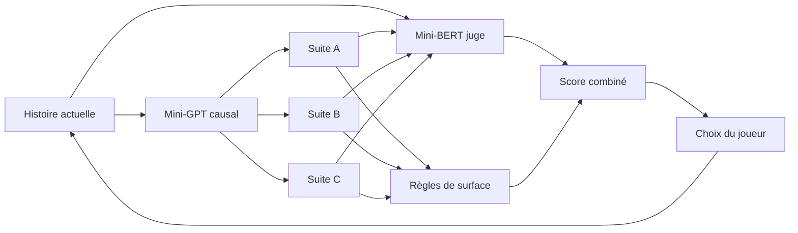
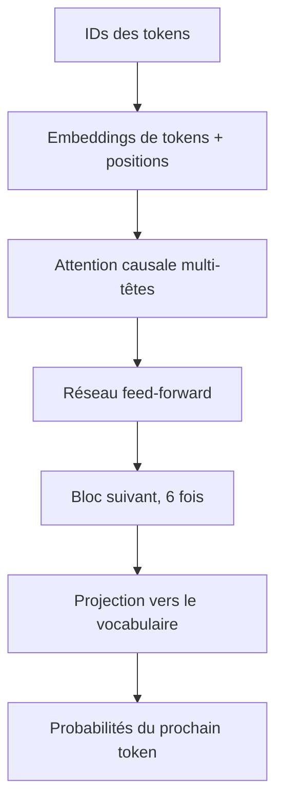
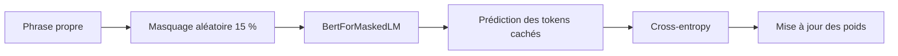
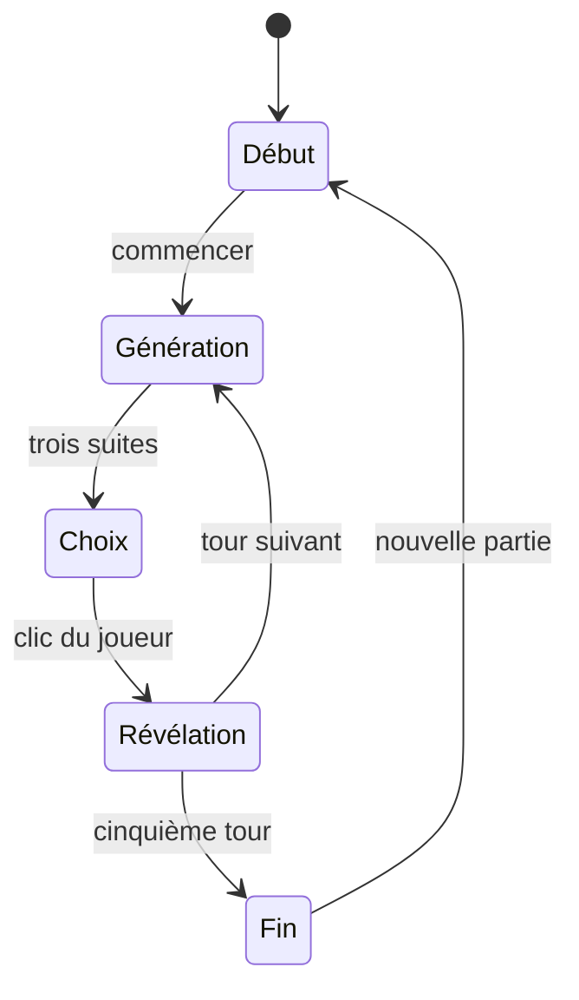
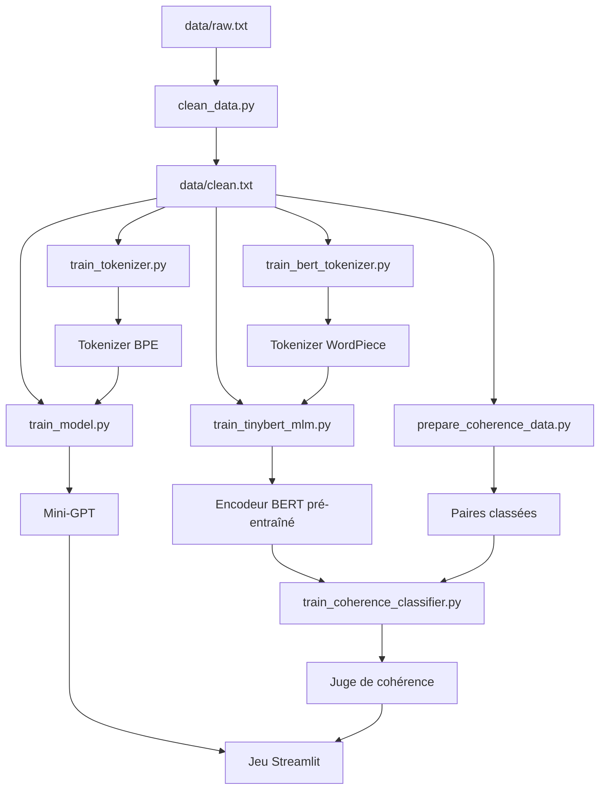

# Comprendre le projet de A à Z

## 1. Idée générale

Le jeu sépare la créativité et l'évaluation :



Le mini-GPT est bon pour produire une suite token après token. Le mini-BERT est bon
pour lire simultanément un contexte et une continuation. Aucun des deux ne remplace
l'autre.

## 2. Du texte aux nombres

Un Transformer reçoit des identifiants entiers. Chaque modèle possède son tokenizer.

### BPE pour GPT

BPE fusionne les groupes de symboles fréquents. Un mot courant peut devenir un token
complet; un mot rare reste une suite de sous-mots. Le tokenizer ByteLevel peut aussi
représenter n'importe quel octet.

```text
"La maison brillait."
        |
        v
["La", " maison", " brill", "ait", "."]
        |
        v
[305, 383, 218, 94, 17]
```

Fichier : `tokenizer/tokenizer.json`.

### WordPiece pour BERT

WordPiece marque généralement les continuations de mot avec `##`.

```text
"prudemment"
        |
        v
["pr", "##ude", "##mment"]
```

Les tokens spéciaux sont `[PAD]`, `[UNK]`, `[CLS]`, `[SEP]` et `[MASK]`.

Une paire donnée au juge ressemble à :

```text
[CLS] contexte de l'histoire [SEP] continuation proposée [SEP]
```

Les `token_type_ids` distinguent la première partie de la seconde.

## 3. Nettoyage

`scripts/clean_data.py` :

1. lit `data/raw.txt`;
2. normalise les espaces;
3. retire les lignes très courtes;
4. conserve les lignes avec ponctuation finale;
5. retire les doublons exacts;
6. écrit `data/clean.txt`.

Le nettoyage ne retire pas les accents ou apostrophes, car ils sont informatifs en
français.

## 4. Mini-GPT : le générateur

Le mini-GPT utilise quatre blocs Transformer causaux. Pour chaque position, son
attention peut regarder uniquement les positions précédentes.



La factorisation apprise est :

```text
P(texte) = P(t1) × P(t2 | t1) × P(t3 | t1,t2) × ...
```

Pendant l'entraînement, les labels sont les mêmes tokens décalés d'une position.
La cross-entropy vaut :

```text
loss = -log P(vrai prochain token)
```

PyTorch calcule les gradients avec `autograd`, puis AdamW modifie les poids.

### Génération

À chaque étape :

1. GPT calcule les probabilités du prochain token;
2. la température transforme leur dispersion;
3. `top_p` conserve un noyau de tokens probables;
4. un token est échantillonné;
5. il est ajouté au contexte;
6. le processus recommence.

Le jeu demande trois générations distinctes. Si un checkpoint émet `[EOS]`
immédiatement, quelques nouvelles tentatives sont faites. Si elles échouent, le jeu
affiche une erreur : il ne remplace jamais une génération par une ligne du corpus.

## 5. Mini-BERT : le juge

BERT est un encodeur bidirectionnel. Chaque token peut regarder à gauche et à droite.
Il ne génère pas la suite : il construit une représentation du couple
`contexte + continuation`.

### Étape A : Masked Language Modeling

Environ 15 % des tokens sont sélectionnés. Le collator remplace une partie par
`[MASK]`, puis BERT doit retrouver les tokens originaux.

```text
Entrée :  La porte [MASK] ouverte.
Cible :            resta
```

Les positions non sélectionnées ont le label `-100` et ne contribuent pas à la loss.



Ce pré-entraînement apprend des représentations générales avant la tâche du jeu.

### Étape B : création des paires narratives

Les passages sont d'abord divisés en ensembles d'entraînement et de validation.
Un positif est ensuite une vraie transition entre deux passages consécutifs :

```text
Contexte positif      : Marie ouvrit la lettre et reconnut l'écriture.
Continuation positive : Elle courut aussitôt chercher son grand-père.
```

Deux types de négatifs plus difficiles sont créés :

- un passage valide mais éloigné dans le corpus ;
- un passage proche du même livre, mais qui n'est pas la vraie suite.

Les classes sont équilibrées pour éviter qu'un modèle gagne en répondant toujours
la même chose. Le découpage effectué avant la création des paires empêche aussi
qu'un exemple identique se retrouve à la fois en entraînement et en validation.

### Étape C : classification

L'encodeur appris en MLM est transféré dans `BertForSequenceClassification`.
La petite tête de classification reçoit la représentation `[CLS]` et produit deux
logits :

```text
logit 0 : incohérent
logit 1 : cohérent
```

Un softmax donne :

```text
P(cohérent) = exp(logit1) / (exp(logit0) + exp(logit1))
```

Ce nombre entre 0 et 1 devient le score neuronal du jeu.

## 6. Score combiné

Le mini-BERT ne détecte pas forcément toutes les répétitions, surtout avec peu de
données. Le projet conserve donc des règles explicables :

- pénalité pour `[UNK]`;
- pénalité pour les mots consécutifs répétés;
- pénalité pour les trigrammes répétés;
- bonus de ponctuation finale;
- préférence pour une longueur raisonnable.

Le score de surface est transformé en nombre entre 0 et 1 avec une sigmoïde :

```text
surface_normalisée = 1 / (1 + exp(-surface / 5))
```

Le score final est :

```text
score_final = 0.75 × cohérence_BERT + 0.25 × surface_normalisée
points = arrondi(score_final × 100)
```

Le poids de 75 % donne la priorité au modèle appris, tout en gardant un garde-fou
lisible.

## 7. Boucle de jeu



Streamlit réexécute le script après chaque interaction. `st.session_state` conserve :

- les phrases déjà choisies;
- le tour actuel;
- le score total;
- les candidats du tour;
- le dernier détail révélé.

## 8. Arbre des apprentissages



## 9. Tests

La commande :

```powershell
python -m pytest -v
```

vérifie :

- les pénalités de répétition et `[UNK]`;
- la construction équilibrée des paires;
- le découpage train/validation;
- le calcul combiné du moteur de jeu;
- les dimensions de sortie d'un GPT et d'un BERT miniatures.

Les tests de formes créent des réseaux aléatoires minuscules. Ils ne téléchargent
aucun modèle.

### Smoke test complet

```powershell
python scripts/run_smoke_test.py
```

La commande équivaut à une version très courte de :

```powershell
python scripts/clean_data.py
python scripts/train_tokenizer.py
python scripts/train_model.py --max_steps 2 --batch_size 2
python scripts/train_bert_tokenizer.py
python scripts/prepare_coherence_data.py
python scripts/train_tinybert_mlm.py --max_steps 2 --batch_size 4
python scripts/train_coherence_classifier.py --max_steps 2 --batch_size 8
python -m pytest
python -m streamlit run app.py
```

Une accuracy proche de 50 % après deux étapes est normale. Le smoke test demande
seulement : « toutes les pièces sont-elles correctement branchées ? »

## 10. Comment améliorer la qualité

1. Utiliser un corpus de plusieurs mégaoctets avec de vrais paragraphes narratifs.
2. Conserver les paragraphes au lieu de traiter uniquement des phrases isolées.
3. Entraîner GPT et BERT pendant davantage d'étapes.
4. Ajouter des négatifs plus subtils : changement de nom, lieu, temps ou objet.
5. Mesurer accuracy, précision, rappel et matrice de confusion.
6. Ajouter un jeu de validation écrit manuellement.
7. Faire plus tard une vraie distillation TinyBERT avec un modèle professeur.

Le point le plus important est la donnée. Les modèles actifs ont été entraînés sur
25 000 passages d'OPUS Books, soit environ 685 000 mots. Ils produisent déjà un
français plus plausible, mais ce volume reste modeste face aux modèles modernes.

## 11. Ressources officielles et articles

- Hugging Face, algorithmes de tokenisation :
  https://huggingface.co/docs/transformers/tokenizer_summary
- Hugging Face Tokenizers, entraîneur WordPiece :
  https://huggingface.co/docs/tokenizers/api/trainers
- Hugging Face, causal language modeling :
  https://huggingface.co/docs/transformers/tasks/language_modeling
- Hugging Face, masked language modeling :
  https://huggingface.co/docs/transformers/tasks/masked_language_modeling
- Hugging Face, documentation BERT :
  https://huggingface.co/docs/transformers/model_doc/bert
- Hugging Face, classification de séquences :
  https://huggingface.co/docs/transformers/tasks/sequence_classification
- Hugging Face, stratégies de génération :
  https://huggingface.co/docs/transformers/generation_strategies
- PyTorch, introduction à `autograd` :
  https://docs.pytorch.org/tutorials/beginner/blitz/autograd_tutorial.html
- Streamlit, état de session :
  https://docs.streamlit.io/develop/api-reference/caching-and-state/st.session_state
- Article TinyBERT original :
  https://arxiv.org/abs/1909.10351
