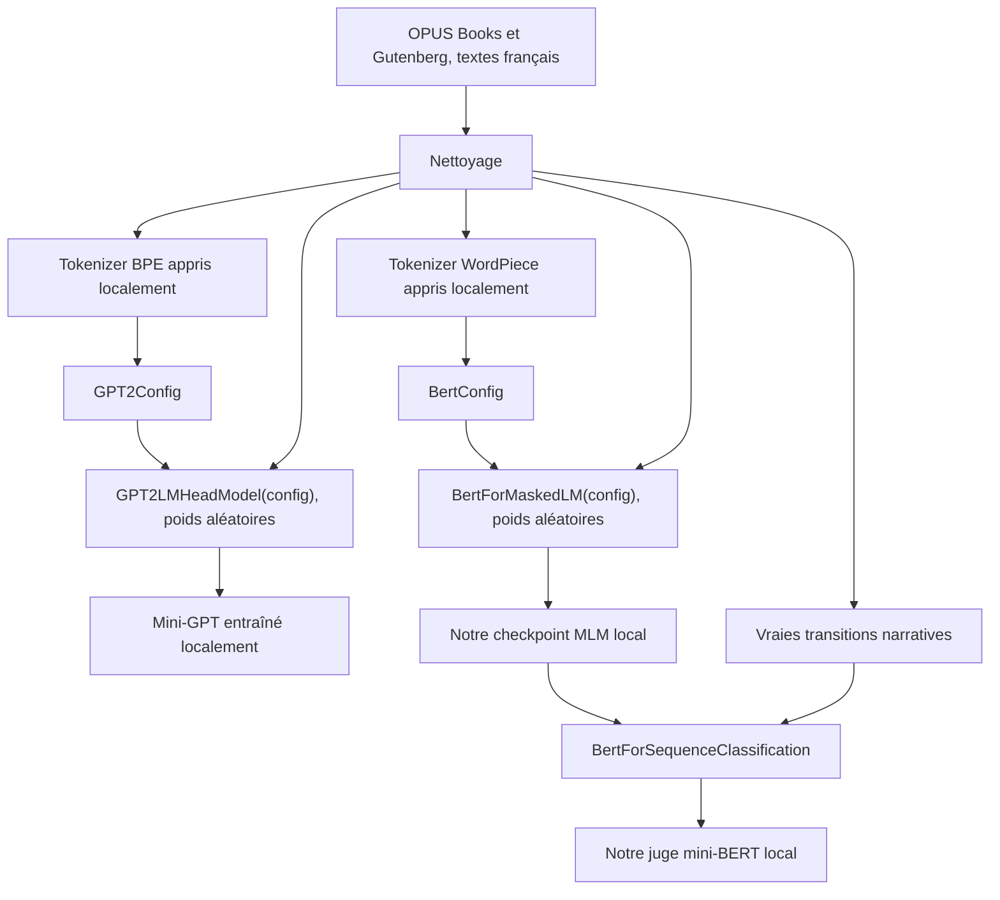
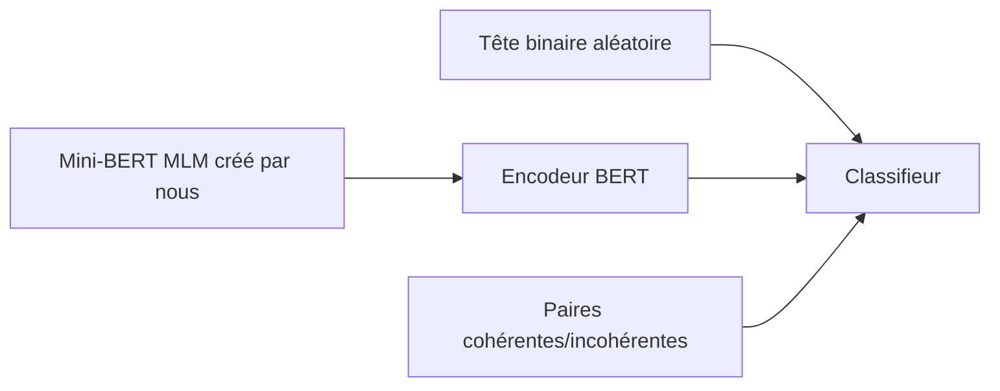

# Preuve de l'entraînement from scratch

## Réponse courte

Oui : aucun poids GPT ou BERT pré-entraîné externe n'a été utilisé.

Le projet utilise les architectures de la librairie Hugging Face, mais crée leurs
poids lui-même. Dire « from scratch » signifie ici :

1. tokenizer appris sur notre corpus ;
2. configuration du réseau définie dans nos scripts ;
3. poids initialisés aléatoirement ;
4. apprentissage effectué localement avec PyTorch ;
5. checkpoints sauvegardés puis rechargés depuis le disque.

Nous n'avons pas recodé l'attention Transformer matrice par matrice. Nous utilisons
les implémentations fiables `GPT2LMHeadModel` et `BertForMaskedLM`.

## Chaîne complète



## Mini-GPT

Dans `scripts/train_model.py` :

```python
config = GPT2Config(...)
model = GPT2LMHeadModel(config)
```

Il n'y a aucun appel à un nom comme `gpt2`, `distilgpt2` ou un dépôt distant.
`GPT2LMHeadModel(config)` initialise les paramètres aléatoirement.

Modèle générateur actif :

- 6 couches ;
- 6 têtes d'attention ;
- dimension cachée 384 ;
- contexte de 256 tokens ;
- vocabulaire BPE de 8 000 tokens ;
- 13 817 856 paramètres ;
- 10 époques, 2 540 mises à jour ;
- loss moyenne : `6.0419 -> 3.6032`.

Le flux d'entraînement est continu. L'ancienne version ajoutait `[EOS]` après
chaque ligne et le modèle apprenait souvent à s'arrêter immédiatement.

## Tokenizer GPT

`scripts/train_tokenizer.py` construit :

```python
Tokenizer(BPE(unk_token="[UNK]"))
```

Puis le `BpeTrainer` apprend les fusions sur `data/clean.txt`. Le fichier
`tokenizer-trained/tokenizer.json` est donc notre vocabulaire, pas celui de GPT-2.

## Mini-BERT v3

Le pré-entraînement MLM commence ainsi :

```python
config = BertConfig(...)
model = BertForMaskedLM(config)
```

Les poids sont donc aléatoires au départ. Le modèle apprend à retrouver environ
15 % de tokens masqués dans notre corpus.

Modèle actif :

- 6 couches ;
- 8 têtes ;
- dimension cachée 256 ;
- dimension intermédiaire 1 024 ;
- vocabulaire WordPiece local de 16 000 tokens ;
- 8 983 424 paramètres pour le MLM ;
- 9 309 mises à jour sur 198 553 paragraphes de 195 livres ;
- loss moyenne par époque : `5.3974 -> 3.6652 -> 3.3584`.

## Classifieur de cohérence

Le classifieur n'est pas réinitialisé entièrement au hasard : il récupère
l'encodeur de notre propre checkpoint MLM, puis ajoute une tête binaire neuve.
C'est la procédure normale « pré-entraînement puis fine-tuning ».



Cela reste un pipeline from scratch, car le pré-entraînement source a lui aussi
été réalisé par nous, sans BERT externe.

Le meilleur checkpoint atteint :

- 391 812 exemples d'entraînement équilibrés ;
- 42 988 exemples de validation issus de 22 livres jamais vus au train ;
- accuracy : `70.22 %` ;
- précision : `67.93 %` ;
- rappel : `76.61 %` ;
- F1 : `72.01 %`.

Le nombre affiché dans le jeu est un score softmax TinyBERT. Ce n'est pas une
probabilité parfaitement calibrée ni une preuve absolue de cohérence.

## Pourquoi voit-on `from_pretrained` ?

Pendant l'inférence, le code contient par exemple :

```python
GPT2LMHeadModel.from_pretrained("checkpoints-story-v2/...")
```

Ici, `from_pretrained` est seulement l'API Hugging Face qui relit un dossier de
poids sauvegardés. Le chemin est local et désigne notre checkpoint. Cette ligne ne
télécharge pas GPT-2.

## Pourquoi l'ancienne partie recopiait des livres

Ce n'était pas le modèle qui écrivait correctement. Il produisait souvent `[EOS]`
immédiatement. Une ancienne fonction remplaçait alors la sortie vide par une ligne
aléatoire de `data/clean.txt`.

Ce secours a été supprimé. Maintenant :

- une sortie vide provoque une nouvelle tentative ;
- après plusieurs échecs, une erreur explicite est levée ;
- aucune ligne du corpus n'est injectée dans la partie ;
- sur l'évaluation v2, `0/15` générations étaient des lignes exactes du corpus.

## Limites honnêtes

Le modèle invente maintenant ses sorties, mais il reste très petit et son corpus
contient des styles, narrateurs et personnages variés. Il peut donc produire une
syntaxe plausible sans maintenir une logique solide sur plusieurs phrases.

Pour franchir un vrai cap, il faut surtout améliorer la qualité du corpus et
entraîner le générateur plus longtemps. Le juge v3 utilise maintenant un corpus
Gutenberg français structuré par livres :

https://huggingface.co/datasets/cabusar/gutenberg-txt-fr

## Vérifications

```powershell
.\.venv-gpu\Scripts\python.exe -m pytest -q
.\.venv-gpu\Scripts\python.exe scripts/evaluate_trained_models.py `
  --validation_file data/coherence-v3-books/validation.jsonl
```

État actuel : 14 tests réussis. Le rapport complet est sauvegardé dans
`outputs/evaluation-v3-books.json`.
