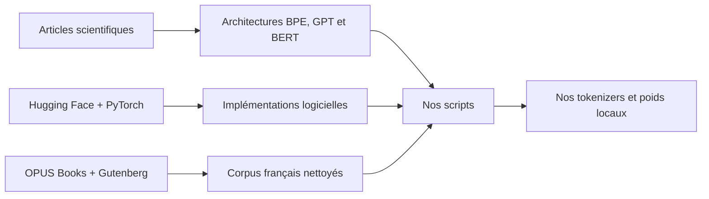

# Provenance des modèles, données et scripts

## Ce qui vient d'où

Le projet assemble quatre niveaux différents qu'il faut bien distinguer :

1. les idées scientifiques ;
2. les implémentations de bibliothèque ;
3. nos données d'entraînement ;
4. nos poids appris localement.



## BPE

**BPE n'est pas un modèle téléchargé.** C'est un algorithme de segmentation en
sous-mots. L'idée appliquée au NLP vient notamment de Sennrich, Haddow et Birch :

https://aclanthology.org/P16-1162/

L'implémentation utilisée est celle de la bibliothèque Hugging Face
`tokenizers`. Notre script crée un objet `BPE`, puis apprend lui-même les fusions
sur notre corpus :

```python
Tokenizer(BPE(unk_token="[UNK]"))
BpeTrainer(vocab_size=16000, ...)
```

Les vocabulaires `tokenizer-trained` et `tokenizer-gutenberg-16k` ont donc été
créés ici. Aucun tokenizer GPT-2 pré-entraîné n'a été repris.

## GPT

L'architecture est inspirée de GPT-2, un Transformer décodeur causal :

https://cdn.openai.com/better-language-models/language_models_are_unsupervised_multitask_learners.pdf

Hugging Face fournit les classes `GPT2Config` et `GPT2LMHeadModel`. Nous utilisons
leur code testé pour les blocs Transformer, mais pas leurs poids :

```python
config = GPT2Config(...)
model = GPT2LMHeadModel(config)
```

Cette construction initialise les matrices aléatoirement. Le modèle apprend ensuite
à prédire chaque prochain token sur nos textes.

### GPT actif

- corpus : 25 000 passages français OPUS Books ;
- tokenizer : BPE local de 8 000 tokens ;
- paramètres : 13 817 856 ;
- architecture : 6 couches, 6 têtes, dimension 384 ;
- entraînement : 2 540 mises à jour, loss `6.0419 -> 3.6032` ;
- dossier : `checkpoints-story-v2`.

### GPT expérimental

- corpus : Gutenberg français structuré par livres ;
- tokenizer : BPE local de 16 000 tokens ;
- paramètres : 57 230 208 ;
- architecture : 12 couches, 9 têtes, dimension 576 ;
- contexte : 256 tokens ;
- première phase : 2 500 mises à jour, loss moyenne `4.9489` ;
- seconde phase : 1 500 mises à jour, loss moyenne `4.3594` ;
- dossiers : `checkpoints-gutenberg-57m` et
  `checkpoints-gutenberg-57m-stage2`.

Il n'est pas encore actif : une grande partie des livres Gutenberg historiques est
sans accents. Le modèle apprend donc souvent `ete`, `pere`, `chateau`. Le script de
préparation accepte maintenant `--min_accent_rate 0.001` pour construire un futur
corpus accentué.

## BERT et “TinyBERT”

BERT vient de Devlin et al. :

https://aclanthology.org/N19-1423/

Nous utilisons `BertConfig`, `BertForMaskedLM` et
`BertForSequenceClassification`, sans checkpoint externe.

Le terme “TinyBERT” est employé dans l'interface pour dire “petit BERT”. Ce n'est
pas exactement le TinyBERT original de Jiao et al., car celui-ci repose sur la
distillation d'un grand professeur :

https://aclanthology.org/2020.findings-emnlp.372/

Notre modèle est plus justement un **mini-BERT entraîné from scratch** :

```python
config = BertConfig(...)
model = BertForMaskedLM(config)
```

Il apprend d'abord par masked language modeling, puis son propre encodeur local est
transféré dans le classifieur de cohérence.

### Juge actif v3

- tokenizer WordPiece local : 16 000 tokens ;
- corpus MLM : 198 553 paragraphes de 195 livres Gutenberg ;
- validation : 17 505 paragraphes de 22 autres livres ;
- architecture : 6 couches, 8 têtes, dimension 256 ;
- paramètres MLM : 8 983 424 ;
- pré-entraînement MLM : 9 309 mises à jour, loss `5.3974 -> 3.3584` ;
- classification : 391 812 paires d'entraînement ;
- validation : 42 988 paires venant de livres jamais vus ;
- accuracy : `70.22 %` ;
- précision : `67.93 %` ;
- rappel : `76.61 %` ;
- F1 : `72.01 %`.

Le score affiché dans le jeu est la sortie softmax de ce classifieur. Il s'agit
d'un score appris, pas d'une certitude mathématique ni d'une probabilité calibrée.

## Corpus

### OPUS Books

Source initiale :

https://huggingface.co/datasets/Helsinki-NLP/opus_books

Le script a sélectionné 25 000 passages français de la configuration `en-fr`.
Cette version a servi au GPT actif et aux premiers prototypes.

### Project Gutenberg

Source amont :

https://www.gutenberg.org/

Archive française utilisée :

https://huggingface.co/datasets/cabusar/gutenberg-txt-fr

Le zip contient 218 fichiers de livres. Après décodage et nettoyage :

- 217 livres exploitables ;
- 195 livres d'entraînement ;
- 22 livres de validation ;
- 198 553 paragraphes train ;
- 17 505 paragraphes validation.

La séparation est faite par livre avant la création des paires. Un roman de
validation ne peut donc pas fournir de passages au train.

Les œuvres Gutenberg ont leurs propres mentions de droits et de redistribution.
Pour une présentation ou une expérimentation académique locale, conserver les
fichiers de provenance et vérifier la licence de chaque source avant diffusion.

## Rôle de chaque script

| Script | Rôle | Entrées principales | Sorties principales |
|---|---|---|---|
| `download_corpus.py` | Télécharge OPUS Books | Hugging Face datasets | `data/raw.txt`, métadonnées |
| `clean_data.py` | Nettoie espaces, longueurs et ponctuation | `data/raw.txt` | `data/clean.txt` |
| `prepare_gutenberg_corpus.py` | Décode les livres, retire les en-têtes, sépare par ouvrage | zip Gutenberg | `data/gutenberg/*.txt`, `books.jsonl` |
| `train_tokenizer.py` | Entraîne le BPE du GPT | corpus propre | `tokenizer.json` |
| `train_model.py` | Crée et entraîne GPT depuis des poids aléatoires | corpus + BPE | checkpoints GPT |
| `generate.py` | Génère plusieurs textes et applique le reranking de surface | prompt + checkpoint GPT | affichage + JSON |
| `score_candidates.py` | Teste les règles de surface seules | textes candidats | scores détaillés |
| `train_bert_tokenizer.py` | Entraîne WordPiece | corpus propre | tokenizer BERT |
| `train_tinybert_mlm.py` | Pré-entraîne le mini-BERT à retrouver les tokens masqués | corpus + WordPiece | checkpoint MLM |
| `prepare_coherence_data.py` | Crée positifs et négatifs narratifs | `books.jsonl` ou texte | JSONL train/validation |
| `train_coherence_classifier.py` | Fine-tune notre encodeur MLM comme juge binaire | paires + checkpoint MLM | classifieur |
| `evaluate_trained_models.py` | Calcule accuracy, précision, rappel, F1 et teste la génération | checkpoints actifs | rapport JSON |
| `run_smoke_test.py` | Vérifie rapidement tout le pipeline | mini-corpus | checkpoints de test |

## Modules de l'application

| Module | Responsabilité |
|---|---|
| `story_game/generation.py` | Charge GPT, échantillonne et termine les phrases |
| `story_game/coherence.py` | Charge le juge BERT et calcule son score |
| `story_game/pair_tokenization.py` | Construit `[CLS] contexte [SEP] suite [SEP]` |
| `story_game/scoring.py` | Pénalités de répétition, longueur, `[UNK]`, ponctuation |
| `story_game/engine.py` | Combine 75 % BERT et 25 % surface |
| `story_game/coherence_data.py` | Fabrique les exemples de classification |
| `story_game/paths.py` | Sélectionne les checkpoints actifs |
| `app.py` | Interface Streamlit et état des tours |

## Pourquoi pas 500 millions de paramètres

AdamW conserve généralement les poids, gradients et deux moments de l'optimiseur.
À 500 M de paramètres, ces états dépassent déjà largement 8 Go, sans compter les
activations. Des techniques comme offload CPU, quantification d'entraînement ou
multi-GPU seraient nécessaires et rendraient l'apprentissage très lent.

Sur cette RTX 4060 Laptop 8 Go, 57 M avec FP16, gradient checkpointing, batch 2 et
accumulation 8 est une taille raisonnable. Le prochain gain doit venir d'un corpus
accentué mieux filtré et de davantage de mises à jour, pas d'un saut direct à
500 M.

## Reranking utilisé dans le jeu

À chaque tour, le GPT génère six continuations. Le mini-BERT et les règles de
surface évaluent les six, puis `story_game/engine.py` conserve les trois meilleurs
scores et mélange leur ordre avant affichage. Après le choix du joueur, les scores
des trois réponses sont révélés.
